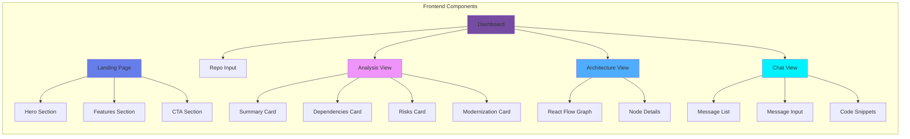
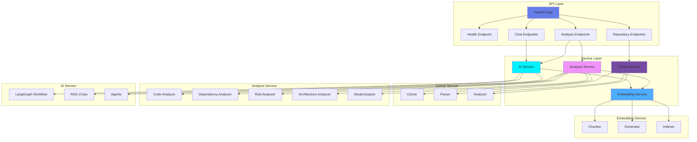
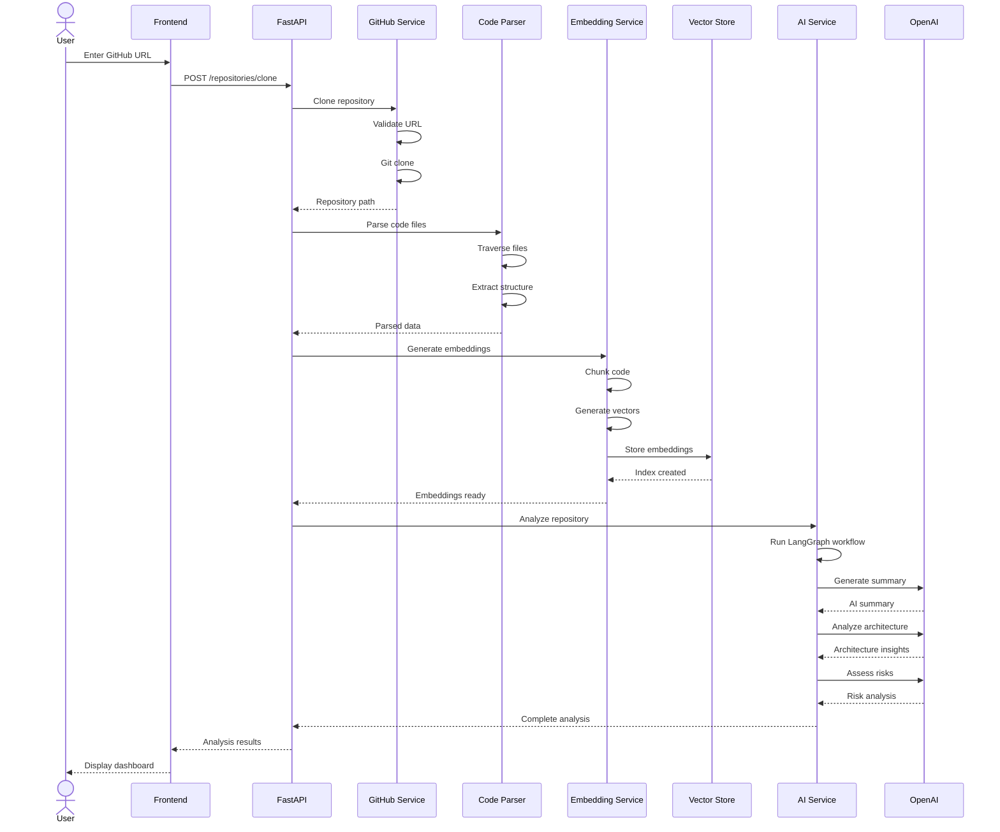
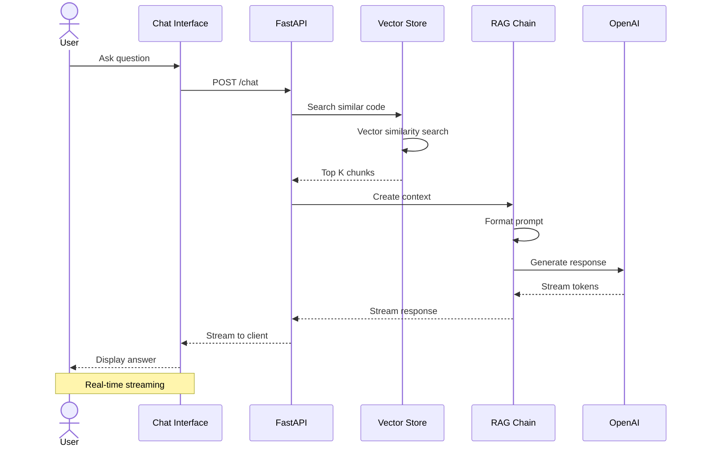
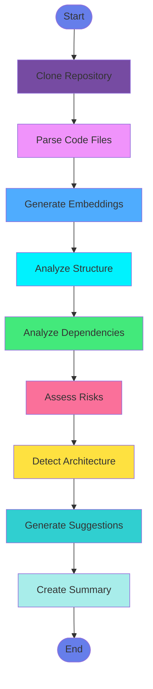
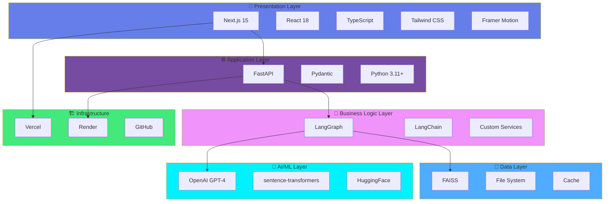
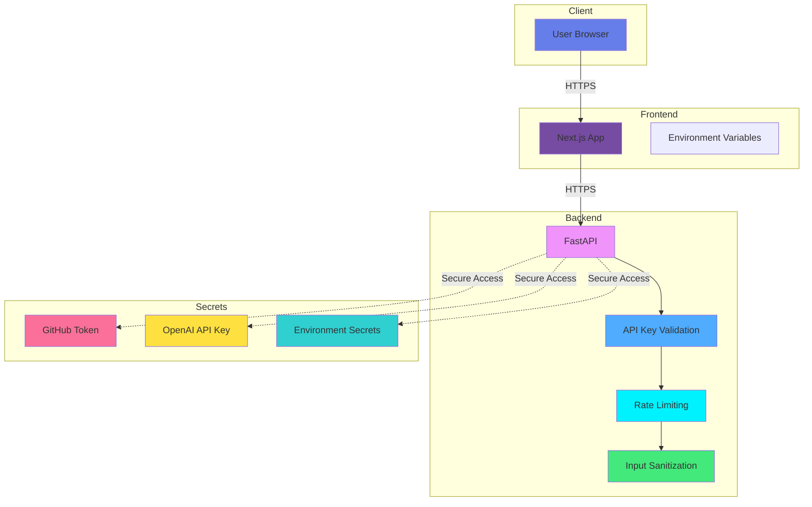
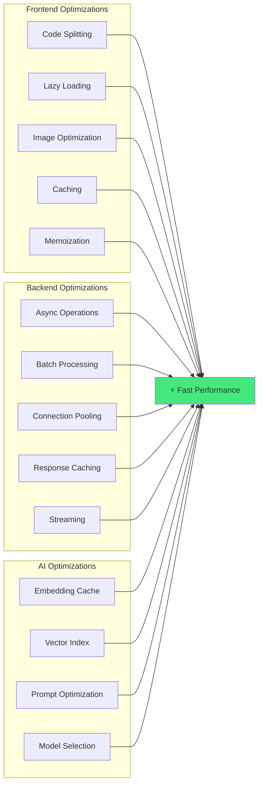

# LegacyMind AI - Architecture Diagrams

## High-Level System Architecture

```mermaid
graph TB
    subgraph Client["🌐 Client (Browser)"]
        UI[Next.js 15 App]
    end
    
    subgraph Frontend["⚛️ Frontend Layer"]
        Pages[Pages/Routes]
        Components[UI Components]
        API_Client[API Client]
        State[State Management]
    end
    
    subgraph Backend["🐍 Backend Layer"]
        FastAPI[FastAPI Server]
        Routes[API Routes]
        Services[Business Services]
        AI[AI Services]
    end
    
    subgraph Data["💾 Data Layer"]
        VectorDB[(FAISS Vector Store)]
        FileSystem[(File System)]
        Cache[(Cache)]
    end
    
    subgraph External["🌍 External Services"]
        GitHub[GitHub API]
        OpenAI[OpenAI API]
        Models[HuggingFace Models]
    end
    
    UI --> Pages
    Pages --> Components
    Components --> API_Client
    API_Client --> State
    
    API_Client -->|HTTP/REST| FastAPI
    FastAPI --> Routes
    Routes --> Services
    Services --> AI
    
    Services --> VectorDB
    Services --> FileSystem
    Services --> Cache
    
    Services -->|Clone Repos| GitHub
    AI -->|LLM Calls| OpenAI
    AI -->|Embeddings| Models
    
    style Client fill:#1a1a2e
    style Frontend fill:#16213e
    style Backend fill:#0f3460
    style Data fill:#533483
    style External fill:#e94560
```



## Component Architecture



## Backend Service Architecture



## Data Flow: Repository Analysis



## Data Flow: AI Chat



## LangGraph Workflow



## Technology Stack Layers



## Deployment Architecture

```mermaid
graph TB
    subgraph Internet["🌐 Internet"]
        Users[Users]
    end
    
    subgraph Vercel["☁️ Vercel (Frontend)"]
        NextJS[Next.js App]
        Edge[Edge Functions]
        CDN[Global CDN]
    end
    
    subgraph Render["☁️ Render (Backend)"]
        API[FastAPI Server]
        Worker[Background Workers]
        Storage[Persistent Storage]
    end
    
    subgraph External["🔌 External APIs"]
        GitHub[GitHub API]
        OpenAI[OpenAI API]
        HF[HuggingFace]
    end
    
    Users --> CDN
    CDN --> NextJS
    NextJS --> Edge
    Edge --> API
    
    API --> Worker
    API --> Storage
    
    API --> GitHub
    API --> OpenAI
    API --> HF
    
    style Internet fill:#1a1a2e
    style Vercel fill:#667eea
    style Render fill:#764ba2
    style External fill:#f093fb
```



## File Structure Visualization

```
LegacyMind-AI/
│
├── 📁 frontend/                    # Next.js 15 Application
│   ├── 📁 src/
│   │   ├── 📁 app/                # App Router
│   │   │   ├── 📄 page.tsx        # Landing page
│   │   │   ├── 📄 layout.tsx      # Root layout
│   │   │   └── 📁 (dashboard)/    # Dashboard routes
│   │   │
│   │   ├── 📁 components/         # React Components
│   │   │   ├── 📁 ui/            # Base components
│   │   │   ├── 📁 features/      # Feature components
│   │   │   └── 📁 layout/        # Layout components
│   │   │
│   │   ├── 📁 lib/               # Utilities
│   │   │   ├── 📁 api/           # API client
│   │   │   ├── 📁 hooks/         # Custom hooks
│   │   │   └── 📁 utils/         # Helper functions
│   │   │
│   │   └── 📁 types/             # TypeScript types
│   │
│   └── 📄 package.json
│
└── 📁 backend/                     # FastAPI Application
    ├── 📁 app/
    │   ├── 📄 main.py             # FastAPI entry
    │   │
    │   ├── 📁 api/                # API routes
    │   │   └── 📁 v1/
    │   │       └── 📁 endpoints/
    │   │
    │   ├── 📁 services/           # Business logic
    │   │   ├── 📁 github/        # GitHub integration
    │   │   ├── 📁 analysis/      # Code analysis
    │   │   ├── 📁 embeddings/    # Vector embeddings
    │   │   ├── 📁 ai/            # AI services
    │   │   └── 📁 vector_store/  # FAISS operations
    │   │
    │   ├── 📁 models/            # Data models
    │   ├── 📁 core/              # Configuration
    │   └── 📁 utils/             # Utilities
    │
    └── 📄 requirements.txt
```

## Security Architecture



## Performance Optimization Strategy



## Conclusion

These diagrams provide a comprehensive visual overview of the LegacyMind AI architecture, showing:

1. **System Architecture**: High-level component interaction
2. **Component Structure**: Frontend and backend organization
3. **Data Flows**: How data moves through the system
4. **LangGraph Workflow**: AI analysis pipeline
5. **Technology Stack**: Layered architecture
6. **Deployment**: Cloud infrastructure
7. **Security**: Protection mechanisms
8. **Performance**: Optimization strategies

This architecture is designed for:
- ✅ Scalability
- ✅ Maintainability
- ✅ Performance
- ✅ Security
- ✅ Developer Experience