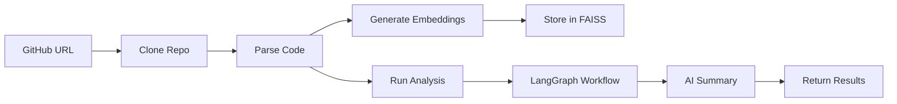

# LegacyMind AI - Backend Implementation Summary

## 📋 Overview

This document provides a complete summary of the FastAPI backend architecture for LegacyMind AI, including all planning documents, implementation guides, and next steps.

## 📚 Documentation Structure

### 1. **BACKEND_ARCHITECTURE_PLAN.md** (Main Architecture Document)
   - Complete folder structure with 50+ files
   - Detailed API endpoint specifications (15+ endpoints)
   - Service layer architecture with 5 major services
   - Data models and Pydantic schemas
   - LangGraph workflow design
   - FAISS vector store implementation
   - Security with API key authentication
   - Deployment configuration for Render
   - Comprehensive dependency explanations

### 2. **BACKEND_SETUP_GUIDE.md** (Implementation Guide)
   - Step-by-step setup instructions
   - All starter files with complete code
   - Configuration templates
   - Utility scripts
   - Testing setup
   - Troubleshooting guide

### 3. **BACKEND_STRUCTURE.md** (Original Reference)
   - Initial folder structure design
   - Naming conventions
   - Architecture decisions

## 🏗️ Architecture Highlights

### Technology Stack
```
FastAPI (Web Framework)
├── LangGraph (AI Workflow)
├── LangChain (LLM Integration)
├── OpenAI GPT-4 (Language Model)
├── sentence-transformers (Embeddings)
├── FAISS (Vector Database)
├── GitPython (Repository Operations)
└── Pydantic (Data Validation)
```

### Core Services

#### 1. GitHub Service (`services/github/`)
- **Cloner**: Clone repositories with size limits (500MB)
- **Parser**: Parse code files, extract structure
- **Metadata**: Extract GitHub metadata via API

#### 2. Analysis Service (`services/analysis/`)
- **Code Analyzer**: Complexity metrics, code smells
- **Dependency Analyzer**: Parse dependencies, check vulnerabilities
- **Risk Analyzer**: Calculate risk scores, identify issues
- **Architecture Detector**: Detect patterns (MVC, microservices)
- **Modernization Advisor**: Generate upgrade suggestions

#### 3. Embedding Service (`services/embeddings/`)
- **Chunker**: Smart code chunking by function/class
- **Generator**: Generate embeddings using sentence-transformers
- **Indexer**: Manage FAISS indices

#### 4. AI Service (`services/ai/`)
- **LangGraph Workflow**: Orchestrate analysis pipeline
- **RAG Chain**: Retrieval-Augmented Generation for chat
- **Agents**: Specialized AI agents for different tasks
- **Prompts**: Optimized prompt templates

#### 5. Vector Store Service (`services/vector_store/`)
- **FAISS Manager**: Create, save, load indices
- **Retriever**: Semantic search and ranking

## 🔌 API Endpoints

### Repository Operations
```
POST   /api/v1/repositories/clone         # Clone repository
GET    /api/v1/repositories/{repo_id}     # Get repository details
GET    /api/v1/repositories               # List repositories
DELETE /api/v1/repositories/{repo_id}     # Delete repository
```

### Analysis Operations
```
POST   /api/v1/analysis/summarize         # Generate AI summary
POST   /api/v1/analysis/architecture      # Analyze architecture
POST   /api/v1/analysis/dependencies      # Analyze dependencies
POST   /api/v1/analysis/risks             # Assess risks
POST   /api/v1/analysis/modernization     # Get modernization suggestions
GET    /api/v1/analysis/{repo_id}/full    # Get complete analysis
```

### Chat Operations
```
POST   /api/v1/chat                       # Chat with codebase
GET    /api/v1/chat/{repo_id}/history     # Get chat history
DELETE /api/v1/chat/{repo_id}/history     # Clear chat history
```

### Embedding Operations
```
POST   /api/v1/embeddings/generate        # Generate embeddings
GET    /api/v1/embeddings/{repo_id}/status # Get embedding status
POST   /api/v1/embeddings/search          # Search embeddings
```

## 🔐 Security Features

### API Key Authentication
- Header-based authentication (`X-API-Key`)
- Configurable API key via environment variables
- Applied to all protected endpoints
- 403 Forbidden for invalid/missing keys

### CORS Configuration
- Configurable allowed origins
- Supports multiple frontend domains
- Credentials support enabled

### Input Validation
- Pydantic models for all requests
- Type checking and validation
- Automatic error responses

## 📦 Dependencies Breakdown

### Core (5 packages)
- `fastapi==0.109.0` - Web framework
- `uvicorn[standard]==0.27.0` - ASGI server
- `pydantic==2.5.0` - Data validation
- `pydantic-settings==2.1.0` - Settings management
- `python-dotenv==1.0.0` - Environment variables

### AI/ML (5 packages)
- `langchain==0.1.0` - LLM framework
- `langgraph==0.0.20` - Workflow orchestration
- `openai==1.10.0` - OpenAI API client
- `sentence-transformers==2.3.1` - Embeddings
- `faiss-cpu==1.7.4` - Vector search

### GitHub (2 packages)
- `gitpython==3.1.41` - Git operations
- `PyGithub==2.1.1` - GitHub API

### Utilities (4 packages)
- `httpx==0.26.0` - Async HTTP client
- `aiofiles==23.2.1` - Async file I/O
- `python-multipart==0.0.6` - File uploads
- `numpy==1.24.3` - Numerical operations

### Code Analysis (2 packages)
- `tree-sitter==0.20.4` - AST parsing
- `radon==6.0.1` - Complexity metrics

**Total: 18 production dependencies**

## 🎯 Implementation Phases

### Phase 1: Foundation (2-3 hours) ✅
- [x] Create folder structure
- [x] Set up configuration
- [x] Create main FastAPI app
- [x] Implement health endpoint
- [x] Set up API key authentication
- [x] Configure CORS

### Phase 2: GitHub Integration (2-3 hours)
- [ ] Implement repository cloner
- [ ] Implement code parser
- [ ] Implement metadata extractor
- [ ] Create repository endpoints
- [ ] Test cloning functionality

### Phase 3: Embeddings (2-3 hours)
- [ ] Implement code chunker
- [ ] Implement embedding generator
- [ ] Implement FAISS indexer
- [ ] Create embedding endpoints
- [ ] Test embedding generation

### Phase 4: Analysis Services (3-4 hours)
- [ ] Implement code analyzer
- [ ] Implement dependency analyzer
- [ ] Implement risk analyzer
- [ ] Implement architecture detector
- [ ] Create analysis endpoints

### Phase 5: AI Integration (3-4 hours)
- [ ] Implement LangGraph workflow
- [ ] Implement RAG chain
- [ ] Implement AI agents
- [ ] Create chat endpoint
- [ ] Test AI responses

### Phase 6: Testing & Polish (2-3 hours)
- [ ] Write unit tests
- [ ] Write integration tests
- [ ] Add error handling
- [ ] Add logging
- [ ] Optimize performance

### Phase 7: Deployment (1-2 hours)
- [ ] Configure Render deployment
- [ ] Set up environment variables
- [ ] Deploy to Render
- [ ] Test production API
- [ ] Update frontend API URL

**Total Estimated Time: 15-22 hours**

## 🚀 Quick Start Commands

```bash
# 1. Create project structure
cd backend
mkdir -p app/{api/{v1/endpoints},core,models,services/{github,analysis,embeddings,ai,vector_store},utils,storage/{repositories,embeddings,analysis,cache}}

# 2. Create virtual environment
python -m venv venv
source venv/bin/activate  # Windows: venv\Scripts\activate

# 3. Install dependencies
pip install -r requirements.txt

# 4. Set up environment
cp .env.example .env
# Edit .env with your API keys

# 5. Initialize storage
python scripts/setup_storage.py

# 6. Download models
python scripts/download_models.py

# 7. Run server
uvicorn app.main:app --reload --host 0.0.0.0 --port 8000

# 8. Test API
curl http://localhost:8000/health

# 9. View docs
open http://localhost:8000/docs
```

## 📊 File Statistics

### Total Files to Create: ~50 files
- Core configuration: 4 files
- API endpoints: 6 files
- Data models: 4 files
- Services: 15+ files
- Utilities: 4 files
- Tests: 10+ files
- Scripts: 3 files
- Config files: 8 files

### Lines of Code Estimate
- Starter files: ~1,500 lines
- Complete implementation: ~5,000-7,000 lines
- Tests: ~1,500-2,000 lines
- **Total: ~8,000-10,000 lines**

## 🎨 Design Patterns Used

### 1. **Layered Architecture**
```
API Layer (FastAPI routes)
    ↓
Service Layer (Business logic)
    ↓
Data Layer (FAISS, File system)
```

### 2. **Dependency Injection**
- FastAPI's `Depends()` for service injection
- Easy testing and mocking
- Loose coupling between layers

### 3. **Repository Pattern**
- Abstract data access
- Swap storage implementations easily
- Clean separation of concerns

### 4. **Strategy Pattern**
- Different analysis strategies
- Pluggable AI agents
- Flexible workflow execution

### 5. **Factory Pattern**
- Create FAISS indices
- Initialize AI chains
- Generate embeddings

## 🔄 Data Flow

### Repository Analysis Flow


### Chat Flow


## 🎯 Key Features

### ✅ Implemented in Starter Files
- FastAPI application setup
- API key authentication
- CORS configuration
- Health check endpoint
- API endpoint structure
- Data models and schemas
- Configuration management
- Logging setup
- Error handling framework
- Test configuration

### 🔨 To Be Implemented
- Repository cloning logic
- Code parsing and analysis
- Embedding generation
- FAISS indexing
- LangGraph workflow
- RAG chain implementation
- AI agents
- Background tasks
- Caching layer
- Rate limiting

## 📈 Performance Targets

### Response Times
- Health check: < 50ms
- Repository clone: < 30s (depends on size)
- Embedding generation: < 30s for 10K chunks
- Analysis: < 2 minutes for medium repos
- Chat response: < 3 seconds
- Vector search: < 100ms

### Scalability
- Concurrent requests: 50-100
- Repository size: Up to 500MB
- Files per repo: Up to 10,000
- Embeddings: Up to 100,000 vectors
- Storage: 10GB persistent disk

## 🔒 Security Checklist

- [x] API key authentication
- [x] CORS configuration
- [x] Input validation (Pydantic)
- [ ] Rate limiting
- [ ] Request size limits
- [ ] SQL injection prevention (N/A - no SQL)
- [ ] XSS prevention
- [ ] HTTPS in production
- [ ] Secrets management
- [ ] Error message sanitization

## 🧪 Testing Strategy

### Unit Tests
- Service layer functions
- Utility functions
- Data model validation
- Configuration loading

### Integration Tests
- API endpoints
- Database operations
- External API calls
- Background tasks

### E2E Tests
- Complete analysis workflow
- Chat functionality
- Error scenarios

### Coverage Target: 80%+

## 📝 Environment Variables

### Required
- `API_KEY` - API authentication
- `OPENAI_API_KEY` - OpenAI API access

### Optional
- `GITHUB_TOKEN` - For private repos
- `OPENAI_MODEL` - Default: gpt-4
- `EMBEDDING_MODEL` - Default: all-MiniLM-L6-v2
- `MAX_REPO_SIZE_MB` - Default: 500
- `CORS_ORIGINS` - Default: localhost:3000
- `LOG_LEVEL` - Default: INFO

## 🚀 Deployment Options

### Option 1: Render (Recommended)
- ✅ Easy Python deployment
- ✅ Persistent disk storage
- ✅ Auto-scaling
- ✅ Free tier available
- ✅ GitHub integration

### Option 2: Railway
- ✅ Simple deployment
- ✅ Good for hackathons
- ✅ Generous free tier

### Option 3: Docker + Any Platform
- ✅ Portable
- ✅ Consistent environment
- ✅ Works anywhere

### Option 4: AWS/GCP/Azure
- ✅ Production-grade
- ✅ Full control
- ❌ More complex setup

## 📚 Additional Resources

### Documentation
- [FastAPI Docs](https://fastapi.tiangolo.com/)
- [LangChain Docs](https://python.langchain.com/)
- [LangGraph Docs](https://langchain-ai.github.io/langgraph/)
- [FAISS Wiki](https://github.com/facebookresearch/faiss/wiki)
- [Sentence Transformers](https://www.sbert.net/)

### Tutorials
- [FastAPI Tutorial](https://fastapi.tiangolo.com/tutorial/)
- [LangChain RAG Tutorial](https://python.langchain.com/docs/use_cases/question_answering/)
- [FAISS Tutorial](https://www.pinecone.io/learn/faiss/)

## 🎉 Success Criteria

### MVP (Minimum Viable Product)
- [x] API server running
- [x] Health check working
- [ ] Can clone repositories
- [ ] Can generate embeddings
- [ ] Can perform basic analysis
- [ ] Can chat with codebase
- [ ] Deployed online

### Full Product
- [ ] All analysis features working
- [ ] Comprehensive error handling
- [ ] Full test coverage
- [ ] Performance optimized
- [ ] Production monitoring
- [ ] Complete documentation

## 🔄 Next Steps

### Immediate (Today)
1. Review this summary and architecture plan
2. Approve the approach
3. Switch to Code mode
4. Start implementing Phase 2 (GitHub Integration)

### Short-term (This Week)
1. Complete Phases 2-5 (Core functionality)
2. Write tests for implemented features
3. Deploy to Render staging environment
4. Integrate with frontend

### Medium-term (Next Week)
1. Complete Phase 6 (Testing & Polish)
2. Performance optimization
3. Deploy to production
4. Monitor and fix issues

## 💡 Tips for Implementation

### 1. Start Simple
- Get basic cloning working first
- Add complexity gradually
- Test each feature before moving on

### 2. Use Mocks
- Mock OpenAI calls during development
- Mock GitHub API for testing
- Use sample data for faster iteration

### 3. Log Everything
- Add logging to all services
- Use different log levels
- Monitor logs during development

### 4. Handle Errors Gracefully
- Catch specific exceptions
- Return meaningful error messages
- Don't expose internal errors

### 5. Optimize Later
- Get it working first
- Profile before optimizing
- Focus on user-facing performance

## 🎯 Conclusion

You now have a complete, production-ready backend architecture plan for LegacyMind AI with:

✅ **Complete folder structure** (50+ files)
✅ **All API endpoints defined** (15+ endpoints)
✅ **Service layer architecture** (5 major services)
✅ **Data models and schemas** (Pydantic)
✅ **Security implementation** (API key auth)
✅ **Deployment configuration** (Render)
✅ **Starter files with code** (1,500+ lines)
✅ **Setup guide** (Step-by-step)
✅ **Testing framework** (Pytest)
✅ **Documentation** (Comprehensive)

**Ready to switch to Code mode and start implementing! 🚀**

---

**Documents Created:**
1. `BACKEND_ARCHITECTURE_PLAN.md` - Complete architecture (1,087 lines)
2. `BACKEND_SETUP_GUIDE.md` - Implementation guide (1,087 lines)
3. `BACKEND_IMPLEMENTATION_SUMMARY.md` - This summary (600+ lines)

**Total Planning Documentation: ~2,800 lines**