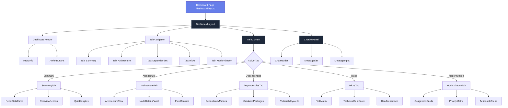
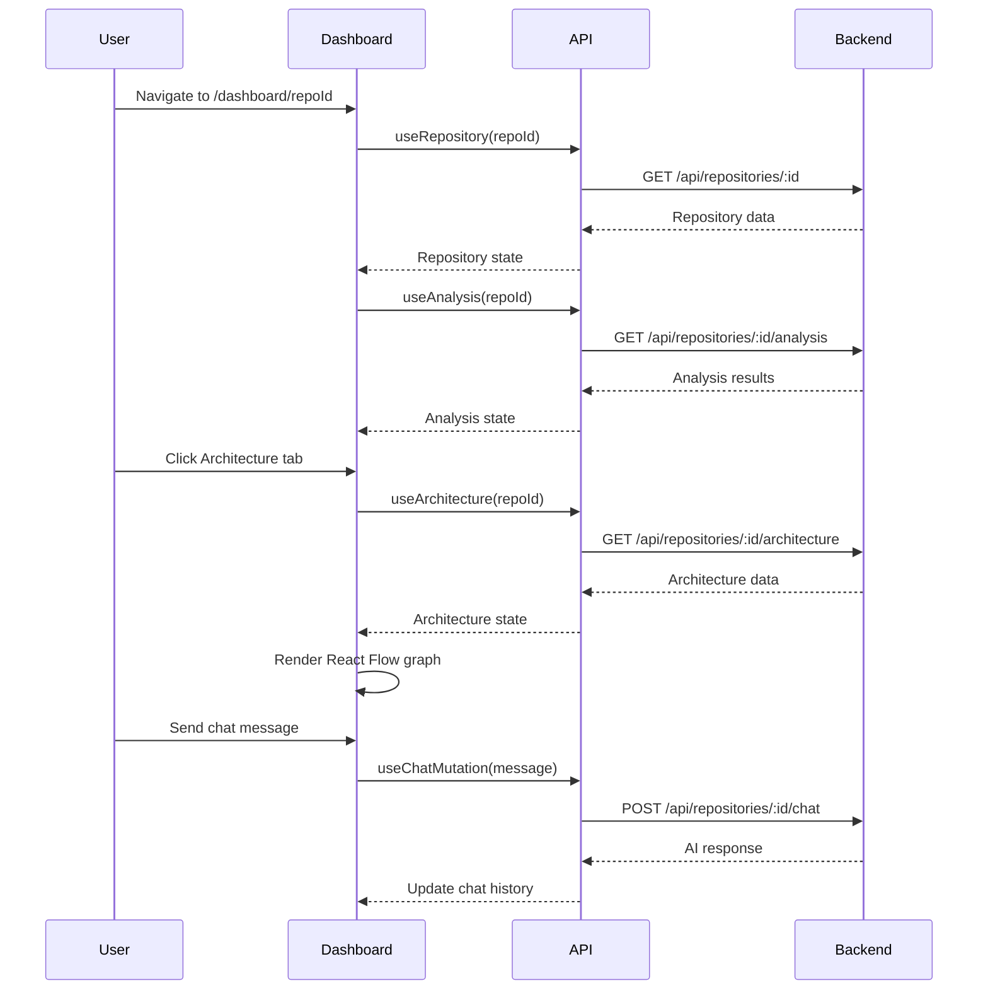
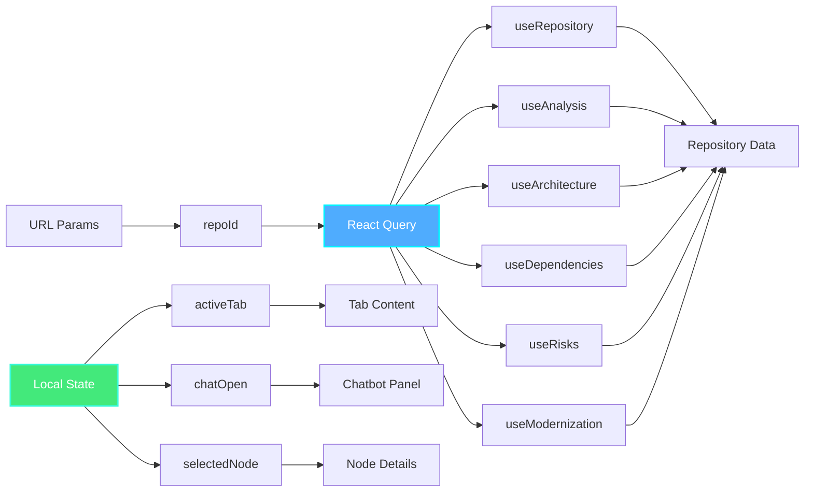
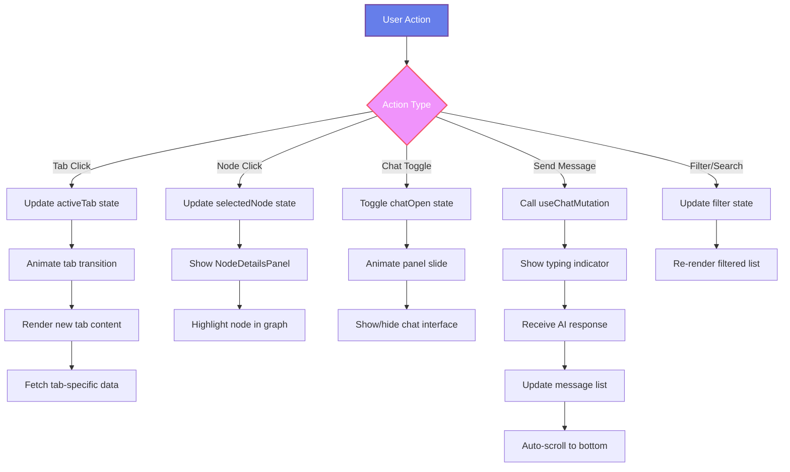
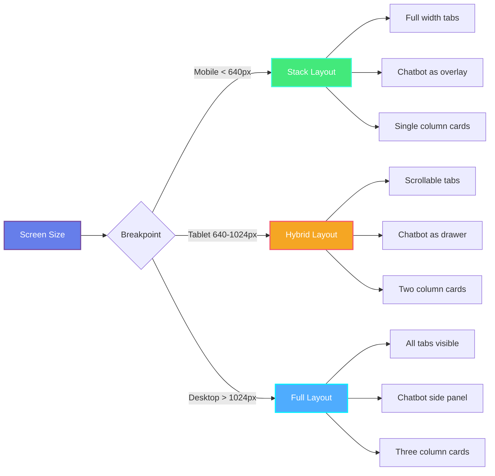
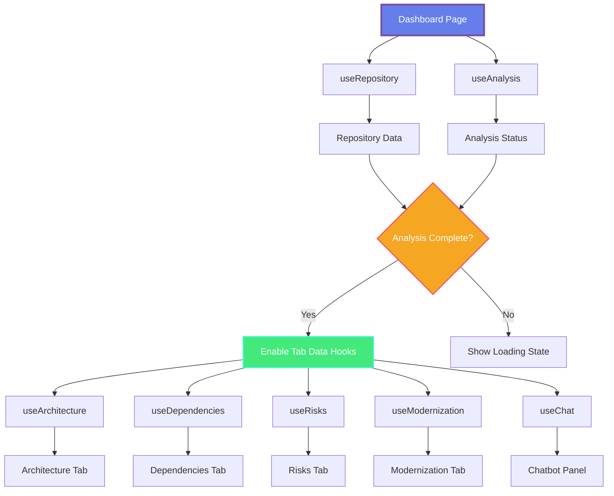
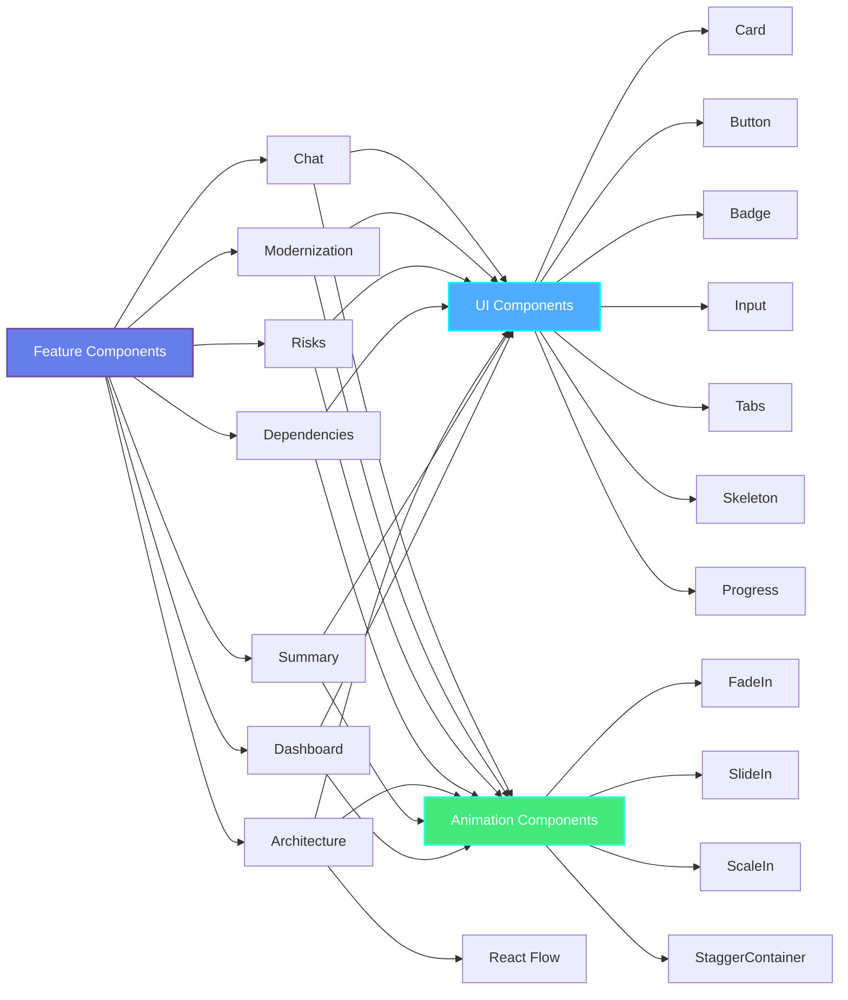

# Dashboard Architecture Diagram

## 🏗️ Component Hierarchy



## 📊 Data Flow



## 🎨 Layout Structure

```
┌─────────────────────────────────────────────────────────────────┐
│ Dashboard Header                                                 │
│ ┌─────────────────────────────────────────────────────────────┐ │
│ │ Repo Name | Owner | Stars | Language        [Actions]       │ │
│ └─────────────────────────────────────────────────────────────┘ │
├─────────────────────────────────────────────────────────────────┤
│ Tab Navigation                                                   │
│ ┌─────────────────────────────────────────────────────────────┐ │
│ │ [Summary] [Architecture] [Dependencies] [Risks] [Modernize] │ │
│ └─────────────────────────────────────────────────────────────┘ │
├─────────────────────────────────────────────────────────────────┤
│                                                                  │
│ Main Content Area                    │ Chatbot Panel           │
│ ┌──────────────────────────────────┐ │ ┌────────────────────┐ │
│ │                                  │ │ │ Chat Header        │ │
│ │                                  │ │ ├────────────────────┤ │
│ │                                  │ │ │                    │ │
│ │   Active Tab Content             │ │ │  Message History   │ │
│ │   (Summary/Architecture/etc)     │ │ │                    │ │
│ │                                  │ │ │                    │ │
│ │                                  │ │ ├────────────────────┤ │
│ │                                  │ │ │ Message Input      │ │
│ └──────────────────────────────────┘ │ └────────────────────┘ │
│                                                                  │
└─────────────────────────────────────────────────────────────────┘
```

## 🔄 State Management



## 🎯 Component Interaction Flow



## 📱 Responsive Behavior



## 🎬 Animation Timeline

```mermaid
gantt
    title Dashboard Load Animation Sequence
    dateFormat X
    axisFormat %L ms
    
    section Initial Load
    Page mount           :0, 0
    Fade in layout       :0, 300
    
    section Header
    Header slide in      :100, 400
    Repo info appear     :200, 500
    
    section Tabs
    Tabs fade in         :300, 600
    Active tab highlight :400, 700
    
    section Content
    Content container    :500, 800
    Stats cards stagger  :600, 1200
    Card 1               :600, 1000
    Card 2               :700, 1100
    Card 3               :800, 1200
    Card 4               :900, 1300
    
    section Chatbot
    Chat panel ready     :1000, 1300
```



## 🔌 API Hook Dependencies



## 📦 Component Dependencies



---

This architecture provides a clear visual representation of how all components interact and flow together in the dashboard.