# GitHub Service Layer - Architecture Diagram

## 🏗️ System Architecture

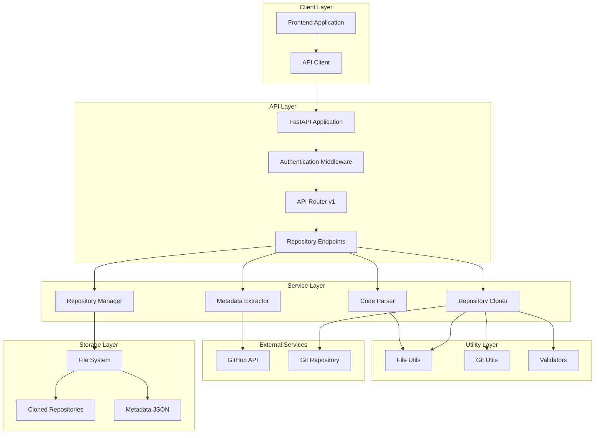

## 🔄 Repository Cloning Flow

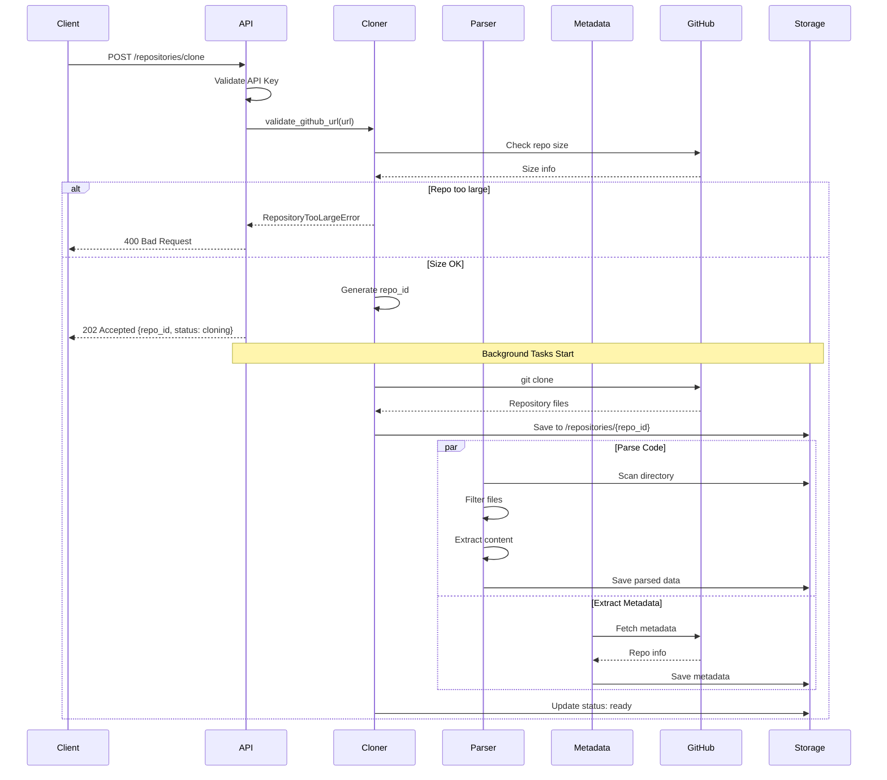

## 📁 File Structure Flow

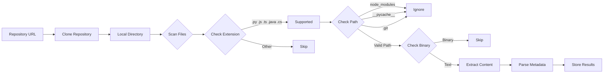

## 🎯 Component Responsibilities

### 1. Repository Cloner
```
┌─────────────────────────────────┐
│   Repository Cloner             │
├─────────────────────────────────┤
│ • Validate GitHub URLs          │
│ • Check repository size         │
│ • Clone using GitPython         │
│ • Generate unique repo IDs      │
│ • Manage storage directories    │
│ • Cleanup old repositories      │
└─────────────────────────────────┘
```

### 2. Code Parser
```
┌─────────────────────────────────┐
│   Code Parser                   │
├─────────────────────────────────┤
│ • Recursive directory scanning  │
│ • File type detection           │
│ • Binary file filtering         │
│ • Content extraction            │
│ • Line counting                 │
│ • Language statistics           │
│ • Dependency parsing            │
└─────────────────────────────────┘
```

### 3. Metadata Extractor
```
┌─────────────────────────────────┐
│   Metadata Extractor            │
├─────────────────────────────────┤
│ • GitHub API integration        │
│ • Repository statistics         │
│ • Language breakdown            │
│ • Contributor information       │
│ • License detection             │
│ • Topic extraction              │
└─────────────────────────────────┘
```

## 🔐 Security Architecture

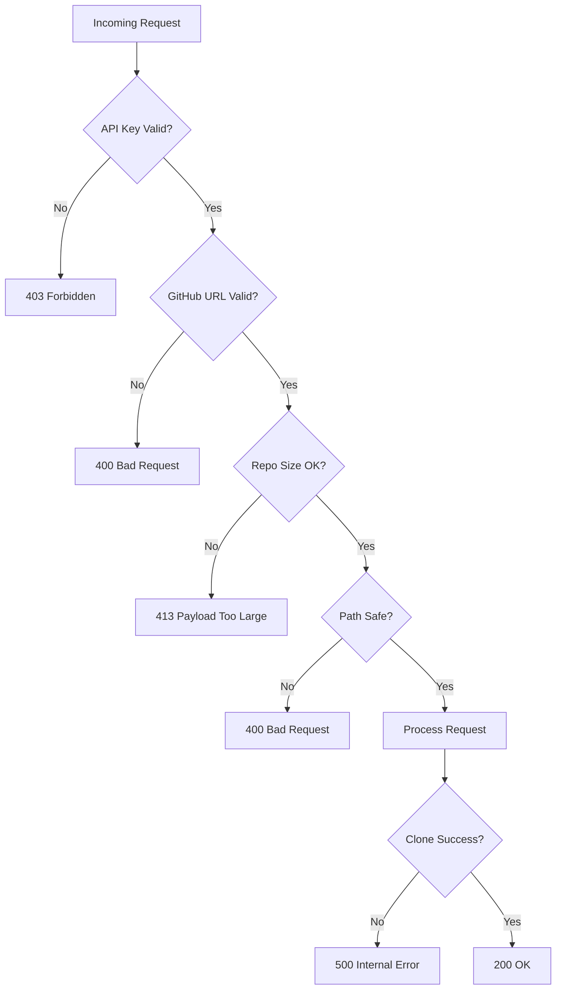

## 📊 Data Flow

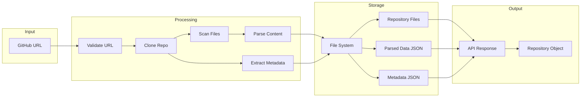

## 🗂️ Storage Structure

```
app/storage/
├── repositories/
│   ├── {repo_id_1}/
│   │   ├── .git/
│   │   ├── src/
│   │   ├── package.json
│   │   └── README.md
│   ├── {repo_id_2}/
│   │   └── ...
│   └── metadata/
│       ├── {repo_id_1}.json
│       └── {repo_id_2}.json
├── cache/
│   └── github_api/
│       └── {owner}_{repo}.json
└── logs/
    └── cloning.log
```

## 🔄 State Machine

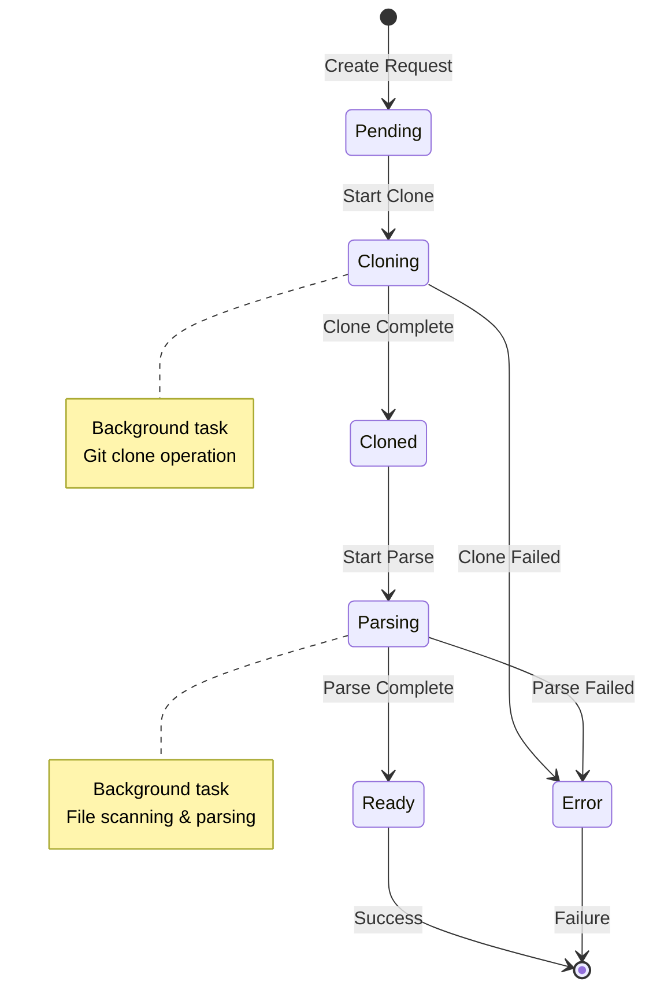

## 🎯 API Endpoint Architecture

```
/api/v1/repositories/
├── POST   /clone
│   ├── Validate URL
│   ├── Check size
│   ├── Start clone (background)
│   └── Return repo_id
│
├── GET    /{repo_id}
│   ├── Load from storage
│   ├── Return full details
│   └── Include parsed data
│
├── GET    /
│   ├── List all repos
│   ├── Pagination support
│   └── Filter by status
│
├── DELETE /{repo_id}
│   ├── Remove from storage
│   ├── Delete metadata
│   └── Cleanup files
│
└── GET    /{repo_id}/files
    ├── Filter by language
    ├── Return file list
    └── Include content
```

## 🧩 Module Dependencies

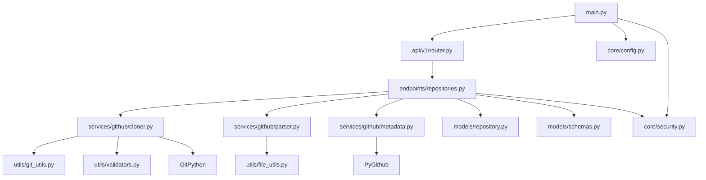

## 🚀 Deployment Architecture

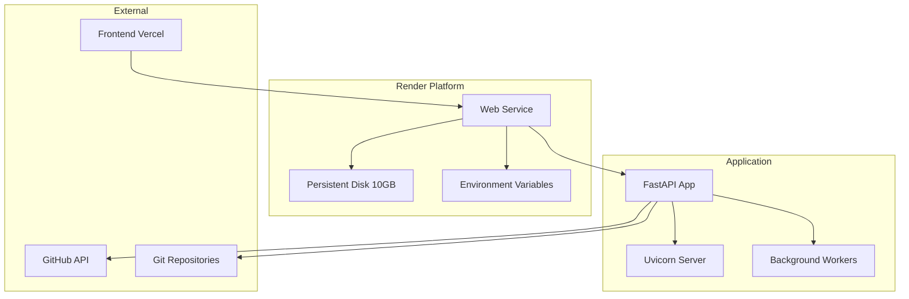

## 📈 Performance Considerations

### Async Operations
```python
# Sequential (Slow)
repo = clone_repository(url)      # 10s
data = parse_repository(repo)     # 5s
meta = get_metadata(url)          # 2s
# Total: 17s

# Parallel (Fast)
repo = await clone_repository(url)           # 10s
data, meta = await asyncio.gather(
    parse_repository(repo),                  # 5s
    get_metadata(url)                        # 2s
)
# Total: 12s (30% faster)
```

### Caching Strategy
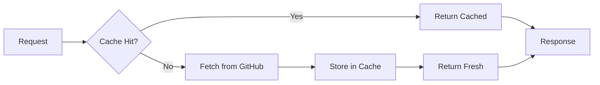

## 🔍 Error Handling Flow

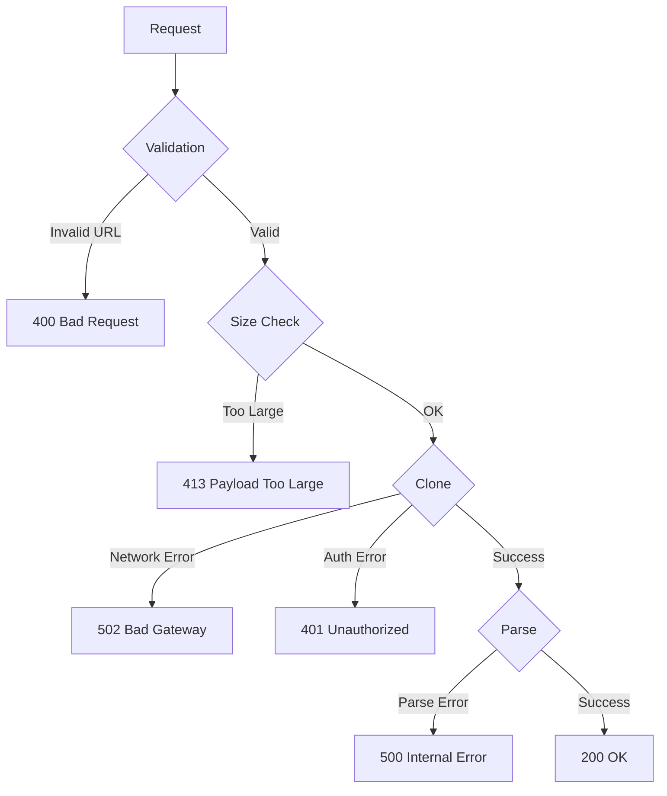

## 🎨 Code Organization

```
services/github/
├── __init__.py
│   └── Export main classes
│
├── cloner.py
│   ├── RepositoryCloner
│   │   ├── __init__()
│   │   ├── clone_repository()
│   │   ├── validate_github_url()
│   │   ├── check_repo_size()
│   │   └── cleanup_repository()
│   └── Helper functions
│
├── parser.py
│   ├── CodeParser
│   │   ├── __init__()
│   │   ├── parse_repository()
│   │   ├── scan_directory()
│   │   ├── should_ignore_path()
│   │   ├── is_binary_file()
│   │   └── extract_file_content()
│   └── Constants (SUPPORTED_EXTENSIONS, etc.)
│
└── metadata.py
    ├── MetadataExtractor
    │   ├── __init__()
    │   ├── get_github_metadata()
    │   ├── get_language_stats()
    │   └── extract_local_metadata()
    └── Helper functions
```

## 🧪 Testing Architecture

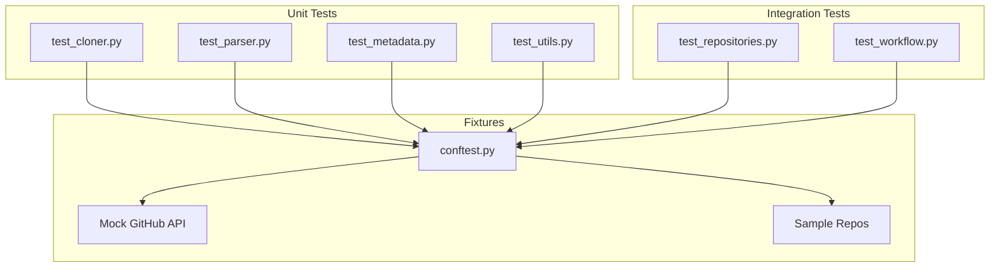

---

This architecture provides:
- ✅ **Clear separation of concerns** - Each component has a single responsibility
- ✅ **Scalable design** - Easy to add new features
- ✅ **Testable structure** - Components can be tested independently
- ✅ **Security-first** - Multiple validation layers
- ✅ **Performance-optimized** - Async operations and caching
- ✅ **Production-ready** - Error handling and monitoring