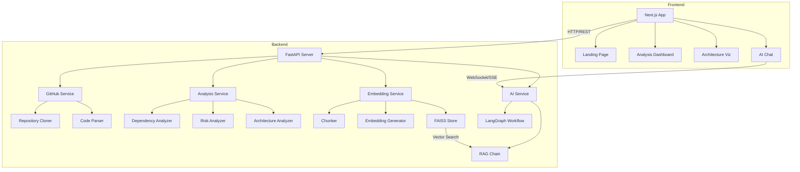
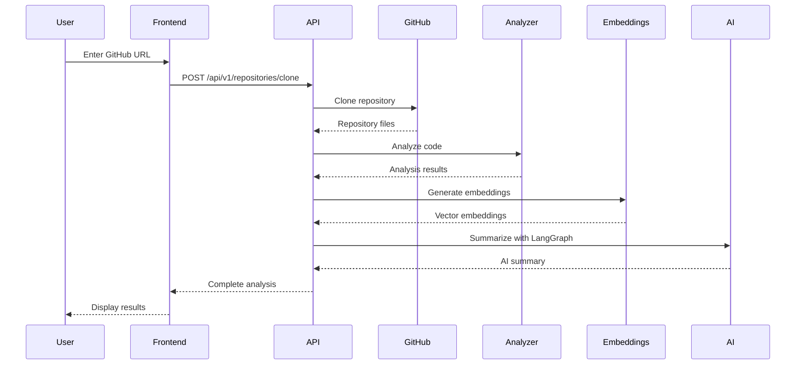
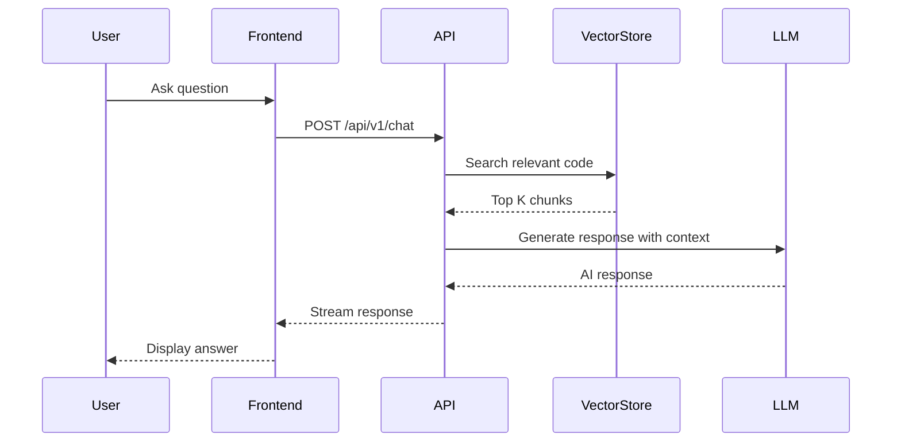

# LegacyMind AI - Implementation Plan

## Project Overview

**LegacyMind AI** is a production-quality hackathon project that analyzes enterprise GitHub repositories using AI to provide:
- Repository summaries
- Architecture understanding
- Dependency analysis
- Risk assessment
- Modernization suggestions
- AI-powered chat with codebase

## Tech Stack

### Frontend
- **Next.js 15** (App Router)
- **TypeScript** (Type safety)
- **Tailwind CSS** (Styling)
- **Framer Motion** (Animations)
- **React Flow** (Architecture visualization)

### Backend
- **FastAPI** (Python web framework)
- **LangGraph** (AI workflow orchestration)
- **LangChain** (LLM integration)
- **FAISS** (Vector database)
- **sentence-transformers** (Embeddings)
- **GitPython** (Repository operations)

## System Architecture



## Data Flow

### 1. Repository Analysis Flow



### 2. AI Chat Flow



## Implementation Phases

### Phase 1: Project Setup (Tasks 1-5)
**Goal**: Initialize both frontend and backend projects

#### Frontend Setup
1. Create Next.js 15 app with TypeScript
   ```bash
   npx create-next-app@latest frontend --typescript --tailwind --app
   ```

2. Install dependencies
   ```bash
   npm install framer-motion reactflow @tanstack/react-query axios clsx tailwind-merge
   ```

3. Configure Tailwind with custom theme
   - Dark mode support
   - Glassmorphism utilities
   - Custom animations

#### Backend Setup
1. Create Python virtual environment
   ```bash
   python -m venv venv
   source venv/bin/activate  # or venv\Scripts\activate on Windows
   ```

2. Install dependencies
   ```bash
   pip install fastapi uvicorn langchain langgraph openai sentence-transformers faiss-cpu gitpython
   ```

3. Set up folder structure
   - Create all directories from BACKEND_STRUCTURE.md
   - Initialize `__init__.py` files

### Phase 2: Core UI Components (Tasks 6-7)
**Goal**: Build reusable UI component library

#### Components to Create
1. **Button** (`components/ui/button.tsx`)
   - Variants: primary, secondary, ghost
   - Sizes: sm, md, lg
   - Loading state
   - Icon support

2. **Card** (`components/ui/card.tsx`)
   - Glassmorphism effect
   - Hover animations
   - Header, body, footer sections

3. **Input** (`components/ui/input.tsx`)
   - Text, URL validation
   - Error states
   - Icon prefix/suffix

4. **Badge** (`components/ui/badge.tsx`)
   - Status indicators
   - Color variants

#### Glassmorphism Styles
Create `styles/glassmorphism.css`:
```css
.glass {
  background: rgba(17, 25, 40, 0.75);
  backdrop-filter: blur(16px) saturate(180%);
  border: 1px solid rgba(255, 255, 255, 0.125);
}

.glass-hover {
  transition: all 0.3s ease;
}

.glass-hover:hover {
  background: rgba(17, 25, 40, 0.85);
  border-color: rgba(255, 255, 255, 0.25);
  transform: translateY(-2px);
}
```

### Phase 3: Frontend Features (Tasks 8-10)
**Goal**: Build main frontend features

#### API Client Layer
Create `lib/api/client.ts`:
- Axios instance with interceptors
- Error handling
- Request/response types
- Base URL configuration

#### Landing Page
Create `app/page.tsx`:
- Hero section with gradient background
- Feature showcase
- CTA button to analyze repository
- Animated elements with Framer Motion

#### Repository Input
Create `components/features/repository/repo-input.tsx`:
- GitHub URL input with validation
- Submit button with loading state
- Error messages
- Success feedback

### Phase 4: Backend Core Services (Tasks 11-16)
**Goal**: Implement core backend functionality

#### 1. FastAPI Main App (`app/main.py`)
```python
from fastapi import FastAPI
from fastapi.middleware.cors import CORSMiddleware
from app.api.v1.router import api_router
from app.core.config import settings

app = FastAPI(title="LegacyMind AI API")

app.add_middleware(
    CORSMiddleware,
    allow_origins=settings.CORS_ORIGINS,
    allow_credentials=True,
    allow_methods=["*"],
    allow_headers=["*"],
)

app.include_router(api_router, prefix="/api/v1")
```

#### 2. GitHub Cloner (`services/github/cloner.py`)
- Clone repository using GitPython
- Validate repository URL
- Handle authentication
- Clean up old repositories
- Size limits

#### 3. Code Parser (`services/github/parser.py`)
- Traverse repository files
- Filter by language
- Extract code structure
- Parse imports/dependencies
- Generate file tree

#### 4. Embedding Generator (`services/embeddings/generator.py`)
```python
from sentence_transformers import SentenceTransformer

class EmbeddingGenerator:
    def __init__(self):
        self.model = SentenceTransformer('all-MiniLM-L6-v2')
    
    def generate(self, texts: list[str]) -> np.ndarray:
        return self.model.encode(texts)
```

#### 5. FAISS Vector Store (`services/vector_store/faiss_store.py`)
- Initialize FAISS index
- Add embeddings with metadata
- Similarity search
- Save/load index

#### 6. Code Chunker (`services/embeddings/chunker.py`)
- Smart chunking by function/class
- Overlap strategy
- Metadata extraction (file path, line numbers)

### Phase 5: AI & Analysis Services (Tasks 17-23)
**Goal**: Implement AI-powered analysis

#### LangGraph Workflow (`services/ai/langgraph_workflow.py`)
```python
from langgraph.graph import StateGraph, END

workflow = StateGraph()

# Define nodes
workflow.add_node("analyze_structure", analyze_structure_node)
workflow.add_node("analyze_dependencies", analyze_dependencies_node)
workflow.add_node("assess_risks", assess_risks_node)
workflow.add_node("generate_summary", generate_summary_node)

# Define edges
workflow.add_edge("analyze_structure", "analyze_dependencies")
workflow.add_edge("analyze_dependencies", "assess_risks")
workflow.add_edge("assess_risks", "generate_summary")
workflow.add_edge("generate_summary", END)

# Set entry point
workflow.set_entry_point("analyze_structure")
```

#### Analysis Endpoints
1. **Repository Summary** (`api/v1/endpoints/analysis.py`)
   - POST `/api/v1/analysis/summarize`
   - Input: repository_id
   - Output: AI-generated summary

2. **Architecture Analysis**
   - POST `/api/v1/analysis/architecture`
   - Detect patterns (MVC, microservices, monolith)
   - Generate component graph

3. **Dependency Analysis**
   - POST `/api/v1/analysis/dependencies`
   - Parse package files
   - Check for outdated packages
   - Security vulnerabilities

4. **Risk Analysis**
   - POST `/api/v1/analysis/risks`
   - Technical debt score
   - Security risks
   - Maintenance complexity

5. **Modernization Suggestions**
   - POST `/api/v1/analysis/modernization`
   - Framework upgrades
   - Best practices
   - Refactoring opportunities

#### AI Chat with RAG
```python
from langchain.chains import RetrievalQA
from langchain.llms import OpenAI

def create_chat_chain(vector_store):
    retriever = vector_store.as_retriever(search_kwargs={"k": 5})
    
    chain = RetrievalQA.from_chain_type(
        llm=OpenAI(temperature=0),
        chain_type="stuff",
        retriever=retriever,
        return_source_documents=True
    )
    
    return chain
```

### Phase 6: Frontend Dashboard (Tasks 24-27)
**Goal**: Build analysis visualization

#### Analysis Dashboard (`app/(dashboard)/repository/[id]/page.tsx`)
- Repository overview card
- Statistics (files, languages, size)
- Tabs for different analyses
- Loading skeletons

#### React Flow Architecture Visualization
Create `components/features/architecture/architecture-flow.tsx`:
- Custom nodes for components
- Edges for dependencies
- Interactive controls
- Zoom/pan
- Node details panel

#### AI Chatbot Interface
Create `components/features/chat/chat-interface.tsx`:
- Message list with scrolling
- Input with send button
- Code snippet rendering
- Streaming responses
- Source citations

#### Loading States & Animations
- Skeleton loaders
- Progress indicators
- Fade-in animations
- Smooth transitions

### Phase 7: Deployment Configuration (Tasks 28-31)
**Goal**: Prepare for production deployment

#### Environment Variables

**Frontend** (`.env.local`):
```env
NEXT_PUBLIC_API_URL=http://localhost:8000
NEXT_PUBLIC_APP_URL=http://localhost:3000
```

**Backend** (`.env`):
```env
OPENAI_API_KEY=sk-...
GITHUB_TOKEN=ghp_...
STORAGE_PATH=./app/storage
EMBEDDING_MODEL=sentence-transformers/all-MiniLM-L6-v2
CORS_ORIGINS=http://localhost:3000
```

#### Vercel Configuration (`vercel.json`)
```json
{
  "buildCommand": "npm run build",
  "outputDirectory": ".next",
  "framework": "nextjs",
  "env": {
    "NEXT_PUBLIC_API_URL": "@api-url"
  }
}
```

#### Render Configuration (`render.yaml`)
```yaml
services:
  - type: web
    name: legacymind-api
    env: python
    buildCommand: pip install -r requirements.txt
    startCommand: uvicorn app.main:app --host 0.0.0.0 --port $PORT
    envVars:
      - key: OPENAI_API_KEY
        sync: false
      - key: GITHUB_TOKEN
        sync: false
```

#### README.md
- Project description
- Features list
- Tech stack
- Setup instructions
- Environment variables
- Deployment guide
- API documentation
- Screenshots

## Key Technical Decisions

### 1. Why Next.js 15 App Router?
- Server components for better performance
- Built-in API routes
- File-based routing
- Optimized for Vercel deployment
- React Server Components

### 2. Why FastAPI?
- High performance (async/await)
- Automatic API documentation
- Type validation with Pydantic
- Easy to deploy
- Python ecosystem for AI/ML

### 3. Why LangGraph?
- Stateful AI workflows
- Better than simple chains
- Modular agent design
- Error handling
- Debugging capabilities

### 4. Why FAISS?
- Fast similarity search
- CPU-friendly (no GPU needed)
- Easy to deploy
- Good for hackathon scale
- Can scale to millions of vectors

### 5. Why sentence-transformers?
- Pre-trained models
- Good quality embeddings
- Fast inference
- Small model size
- Easy to use

## Performance Optimizations

### Frontend
1. **Code Splitting**: Dynamic imports for heavy components
2. **Image Optimization**: Next.js Image component
3. **Caching**: React Query for API responses
4. **Lazy Loading**: Intersection Observer for components
5. **Memoization**: React.memo for expensive renders

### Backend
1. **Async Operations**: All I/O is async
2. **Batch Processing**: Batch embeddings generation
3. **Caching**: Cache analysis results
4. **Connection Pooling**: Reuse HTTP connections
5. **Streaming**: Stream chat responses

## Security Considerations

1. **API Keys**: Store in environment variables
2. **CORS**: Whitelist frontend domain
3. **Rate Limiting**: Prevent abuse
4. **Input Validation**: Validate all inputs
5. **Sanitization**: Clean user inputs
6. **HTTPS**: Use HTTPS in production

## Testing Strategy

### Frontend
- Unit tests: Jest + React Testing Library
- E2E tests: Playwright
- Component tests: Storybook

### Backend
- Unit tests: pytest
- Integration tests: TestClient
- API tests: httpx

## Monitoring & Logging

### Frontend
- Error tracking: Sentry
- Analytics: Vercel Analytics
- Performance: Web Vitals

### Backend
- Logging: Python logging module
- Error tracking: Sentry
- Metrics: Prometheus (optional)

## Future Enhancements

1. **User Authentication**: Add login/signup
2. **Database**: Store analysis history
3. **Webhooks**: GitHub webhook integration
4. **Collaboration**: Share analyses
5. **Export**: PDF/Markdown reports
6. **CI/CD Integration**: GitHub Actions analysis
7. **Multi-repo**: Compare multiple repositories
8. **Custom Rules**: User-defined analysis rules

## Timeline Estimate

- **Phase 1**: 2-3 hours (Setup)
- **Phase 2**: 3-4 hours (UI Components)
- **Phase 3**: 2-3 hours (Frontend Features)
- **Phase 4**: 4-5 hours (Backend Core)
- **Phase 5**: 5-6 hours (AI Services)
- **Phase 6**: 4-5 hours (Dashboard)
- **Phase 7**: 2-3 hours (Deployment)

**Total**: 22-29 hours (Hackathon weekend)

## Success Metrics

1. ✅ Successfully clone and analyze repositories
2. ✅ Generate accurate embeddings
3. ✅ Provide meaningful AI insights
4. ✅ Smooth, responsive UI
5. ✅ Fast analysis (<2 minutes for medium repos)
6. ✅ Working chat with codebase
7. ✅ Deployed and accessible online

## Conclusion

This implementation plan provides a clear roadmap for building LegacyMind AI. The architecture is scalable, the tech stack is modern, and the features are impressive for a hackathon project. By following this plan step-by-step, you'll create a production-quality application that showcases AI capabilities in code analysis.

Ready to start building! 🚀